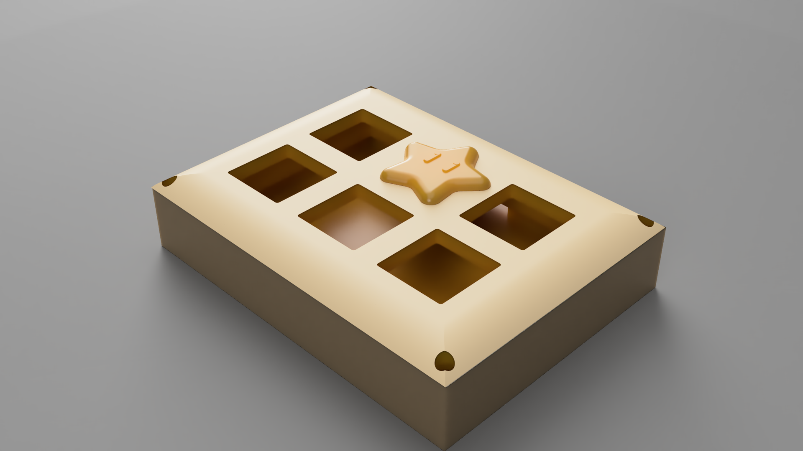

# The-StarPad
A amazing and tiny macropad to make more easy any action

## About :
A tiny 5 key macropad with a rotary encoder
Project link : https://hackpad.hackclub.com/guide

## Features :
-4 configurable keys for almost anything via VIA
-A rotary encoder for the sound
-A tiny size that lets you take it anywhere.

## Parts :
- 1x Seeed XIAO RP2040
- 4x MX-Style switches
- 1x EC11 Rotary encoders
- 4x white blank DSA keycaps
- 4x M3x5mx4mm heatset inserts
- 4x M3x10mm screws

## Photos :
